# 📋 Product Requirement Document (PRD)

# Gudang Visa Tracking System

### Sistem Monitoring & Pelacakan Dokumen Keimigrasian

---

| Field             | Detail                                                                                         |
| ----------------- | ---------------------------------------------------------------------------------------------- |
| **Nama Proyek**   | Gudang Visa Tracking System                                                                    |
| **Versi Dokumen** | 1.7.0                                                                                          |
| **Tanggal**       | 1 June 2026                                                                                    |
| **Penulis**       | Tim Pengembang Gudang Visa                                                                     |
| **Tech Stack**    | Vue.js · TailwindCSS · ShadCN-Vue · Node.js · Express.js · PostgreSQL · Supabase · Drizzle ORM |

---

## Daftar Isi

1. [Pendahuluan](#1-pendahuluan)
   - 1.1 [Latar Belakang](#11-latar-belakang)
   - 1.2 [Tujuan Proyek](#12-tujuan-proyek)
   - 1.3 [Target Pengguna](#13-target-pengguna)
   - 1.4 [Analisa Masalah dan Solusi](#14-analisa-masalah-dan-solusi)
   - 1.5 [Metode Pengembangan](#15-metode-pengembangan)
2. [Batasan Sistem](#2-batasan-sistem-scope)
   - 2.1 [Di Dalam Cakupan (In Scope)](#21-di-dalam-cakupan-in-scope)
   - 2.2 [Di Luar Cakupan (Out of Scope)](#22-di-luar-cakupan-out-of-scope)
   - 2.3 [Batasan Perangkat Lunak](#23-batasan-perangkat-lunak)
3. [Arsitektur Sistem](#3-arsitektur-sistem)
4. [Entity Relationship Diagram (ERD)](#4-entity-relationship-diagram-erd)
5. [Logical Record Structure (LRS)](#5-logical-record-structure-lrs)
6. [Database Schema Detail](#6-database-schema-detail)
7. [Class Diagram](#7-class-diagram)
8. [Activity Diagram](#8-activity-diagram)
9. [Sequence Diagram](#9-sequence-diagram)
10. [Spesifikasi Fitur](#10-spesifikasi-fitur)
11. [Keamanan & Otorisasi](#11-keamanan--otorisasi)
12. [Non-Functional Requirements](#12-non-functional-requirements)
13. [Tech Stack & Dependency](#13-tech-stack--dependency)
14. [Rencana Implementasi](#14-rencana-implementasi)
15. [Lampiran](#15-lampiran)

---

## 1. Pendahuluan

### 1.1 Latar Belakang

Untuk meningkatkan efisiensi dan transparansi pengurusan dokumen keimigrasian di **Gudang Visa Bali Indonesia**, dikembangkan sebuah sistem monitoring dan pelacakan berbasis web terintegrasi. Sistem ini dirancang untuk:

- **Menggantikan pengelolaan manual** spreadsheet dan chat group yang rawan kehilangan data.
- **Bi-Otorisasi Terpisah (Data Segregation)**: Memisahkan secara mutlak basis data pengguna internal perusahaan (Admin/Staf) dengan pelanggan (Client) demi keamanan data keimigrasian dan pencegahan serangan _privilege escalation_.
- **Skema Database Super Ringkas & Optimal**: Mengoptimalkan struktur basis data secara ekstrem dari 12 tabel menjadi hanya **7 tabel utama**. Data penjadwalan biometrik (relasi 1-to-1) dilebur langsung ke dalam tabel utama `applications`, master data dikonversi menjadi _PostgreSQL Native Enums_, dan sistem checklist diimplementasikan secara dinamis menggunakan kolom **JSONB**. Hal ini meningkatkan performa kueri secara maksimal tanpa beban _JOIN_ yang berat.
- **Memberikan ketenangan bagi klien (_Give Peace of Mind_)**: Memungkinkan klien memantau kemajuan dokumen secara jarak jauh dan aman secara mandiri dari rumah mereka setelah login ke portal pribadi.
- **Meningkatkan akuntabilitas staf** melalui audit trail otomatis pada setiap perubahan status.
- **Mempercepat alur kerja internal** dengan checklist verifikasi terstruktur dan penjadwalan biometrik.

### 1.2 Tujuan Proyek

| #   | Tujuan                            | KPI Target                                                       |
| --- | --------------------------------- | ---------------------------------------------------------------- |
| 1   | Transparansi real-time bagi klien | Klien dapat melihat status ≤ 5 detik setelah update              |
| 2   | Eliminasi kesalahan manual        | Penurunan error tracking ≥ 80%                                   |
| 3   | Audit trail lengkap               | 100% perubahan status tercatat                                   |
| 4   | Keamanan & Efisiensi Data         | Zero data breach, minimalisasi latensi kueri dengan reduksi JOIN |
| 5   | Efisiensi waktu staf              | Pengurangan waktu administrasi ≥ 50%                             |

### 1.3 Target Pengguna

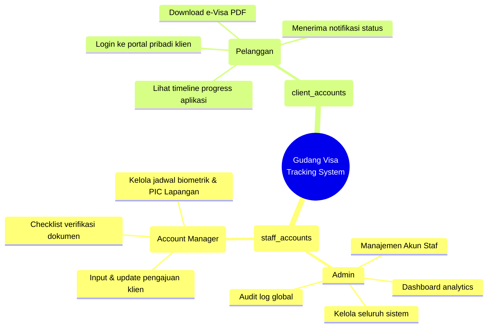

### 1.4 Analisa Masalah dan Solusi

Berdasarkan latar belakang yang telah diuraikan, terdapat beberapa permasalahan yang terjadi pada **PT Gudang Visa Indonesia Bali** yang perlu diselesaikan melalui pengembangan sistem ini.

#### 1.4.1 Identifikasi Masalah

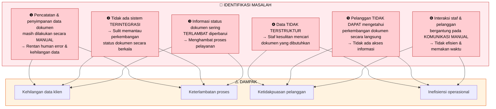

|  No  | Masalah                                                                                                                                                  | Kategori      | Tingkat Urgensi |
| :--: | -------------------------------------------------------------------------------------------------------------------------------------------------------- | ------------- | :-------------: |
| M-01 | Proses pencatatan dan penyimpanan data dokumen masih dilakukan secara **manual** sehingga rentan terhadap kesalahan (_human error_) dan kehilangan data. | Proses & Data |    🔴 Tinggi    |
| M-02 | **Tidak adanya sistem terintegrasi** menyebabkan kesulitan dalam memantau perkembangan status dokumen secara berkala.                                    | Sistem        |    🔴 Tinggi    |
| M-03 | Informasi terkait status dokumen sering **terlambat diperbarui** sehingga menghambat proses pelayanan.                                                   | Proses        |    🟡 Sedang    |
| M-04 | Data yang **tidak terstruktur** dengan baik menyulitkan staf dalam mencari dokumen yang dibutuhkan.                                                      | Data          |    🟡 Sedang    |
| M-05 | Pelanggan **tidak dapat mengetahui** perkembangan dokumen secara langsung karena tidak adanya sistem yang menyediakan akses informasi.                   | Akses         |    🔴 Tinggi    |
| M-06 | Interaksi antara staf & pelanggan masih bergantung pada **komunikasi manual**, sehingga tidak efisien dan memakan waktu.                                 | Komunikasi    |    🟡 Sedang    |

#### 1.4.2 Solusi yang Diusulkan

Untuk mengatasi permasalahan yang ada, diusulkan pengembangan **Sistem Informasi Pemantauan Dokumen Pengurusan Visa Berbasis Website** dengan pendekatan sebagai berikut:

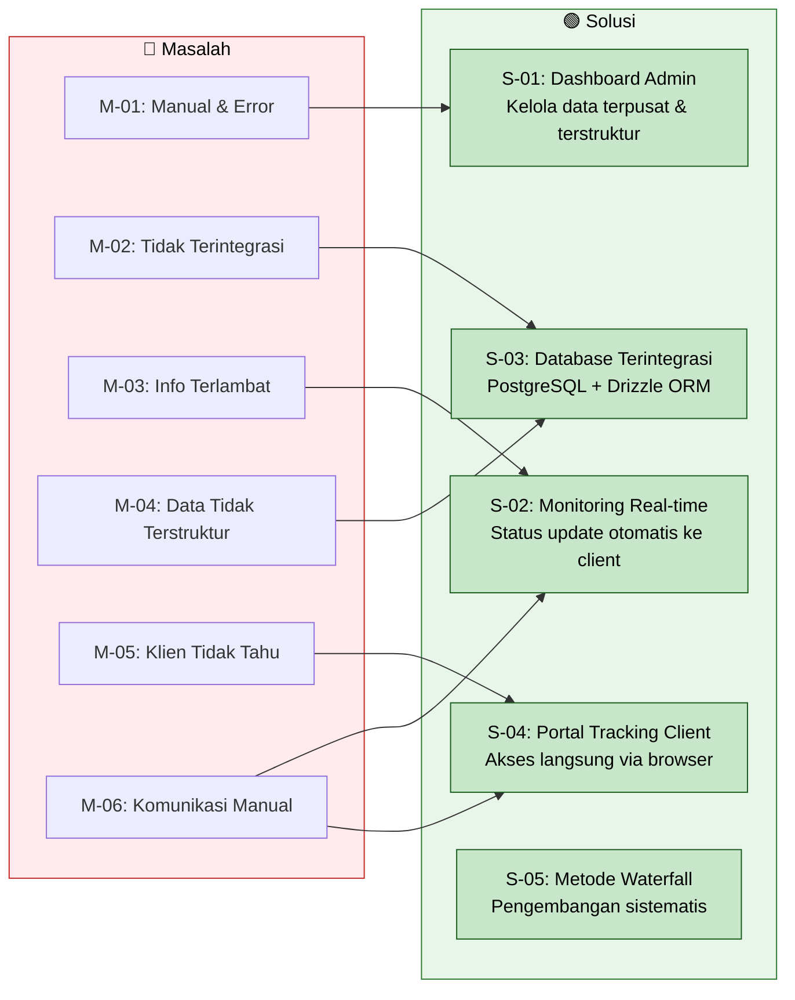

|  No  | Solusi                                                                                                                                                                                                                           | Masalah yang Diselesaikan | Implementasi Teknis                                                                        |
| :--: | -------------------------------------------------------------------------------------------------------------------------------------------------------------------------------------------------------------------------------- | :-----------------------: | ------------------------------------------------------------------------------------------ |
| S-01 | Mengembangkan **sistem berbasis web** yang memungkinkan admin mengelola data dokumen secara terstruktur dan terpusat, sehingga mengurangi kesalahan manual.                                                                      |        M-01, M-04         | Dashboard Admin/Staff dengan Vue.js + ShadCN-Vue, CRUD terstruktur via Express.js API      |
| S-02 | Menyediakan fitur **pemantauan status dokumen secara real-time** yang dapat diakses oleh pelanggan melalui dashboard sistem setelah login.                                                                                       |     M-03, M-05, M-06      | Supabase Realtime (WebSocket), tracking timeline component, push notifications             |
| S-03 | Membangun **sistem basis data terintegrasi** untuk mempermudah proses penyimpanan, pengelolaan, dan pencarian data secara cepat dan akurat.                                                                                      |        M-02, M-04         | PostgreSQL via Supabase, Drizzle ORM schema, indexed queries, full-text search             |
| S-04 | Meningkatkan **transparansi informasi** dengan menyediakan akses langsung kepada pelanggan terhadap status dokumen yang sedang diproses.                                                                                         |        M-05, M-06         | Client Tracking Portal dengan RLS (Row Level Security), progress timeline, e-Visa download |
| S-05 | Menerapkan **metode pengembangan sistem Waterfall** yang meliputi tahap analisis kebutuhan, perancangan sistem, implementasi, pengujian, dan pemeliharaan, sehingga sistem dapat dikembangkan secara sistematis dan terstruktur. |           Semua           | Waterfall SDLC: Analysis → Design → Implementation → Testing → Maintenance                 |

### 1.5 Metode Pengembangan

Sistem dikembangkan menggunakan **metode Waterfall** yang dipilih karena kebutuhan sistem sudah terdefinisi dengan jelas dan stabil. Berikut adalah tahapan pengembangan:

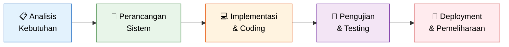

| Tahap                         | Aktivitas                                                                                       | Output                               |
| ----------------------------- | ----------------------------------------------------------------------------------------------- | ------------------------------------ |
| **Analisis Kebutuhan**        | Wawancara stakeholder, identifikasi masalah, analisis kebutuhan fungsional & non-fungsional     | Dokumen PRD, SRS                     |
| **Perancangan Sistem**        | Desain arsitektur, ERD, LRS, class diagram, activity diagram, sequence diagram, wireframe UI/UX | Dokumen desain sistem, prototype     |
| **Implementasi**              | Pengkodean frontend (Vue.js), backend (Express.js), database (PostgreSQL), integrasi Supabase   | Source code, database schema         |
| **Pengujian**                 | Black-box testing, usability testing, security testing, performance testing                     | Laporan hasil pengujian              |
| **Deployment & Pemeliharaan** | Deploy ke production, monitoring, bug fixing, iterasi improvement                               | Sistem live, dokumentasi maintenance |

---

## 2. Batasan Sistem (Scope)

### 2.1 Di Dalam Cakupan (IN SCOPE)

> [!IMPORTANT]
> Sistem ini HANYA berfokus pada **monitoring dan tracking dokumen**, bukan pada registrasi online, logistik kurir fisik, ataupun penanganan transaksi pembayaran.

| #    | Fitur                             | Deskripsi                                                                                                                               |
| ---- | --------------------------------- | --------------------------------------------------------------------------------------------------------------------------------------- |
| F-01 | **Dashboard Admin**               | Overview seluruh pengajuan, manajemen user staf, analytics, audit log global.                                                           |
| F-02 | **Dashboard Staff**               | CRM alur kerja internal: input pengajuan client, checklist verifikasi, update status.                                                   |
| F-03 | **Portal Client**                 | Login klien terpisah (`/portal/login`) menuju dashboard pelacakan pribadi (`/portal`): timeline progress dokumen, download e-Visa/berkas PDF yang telah selesai, pembaruan status _live_ otomatis (tanpa refresh manual). |
| F-04 | **Authentication Multi-Table**    | Login terpisah untuk Internal (`staff_accounts`) dan External (`client_accounts`) dengan enkripsi password hash lokal dan JWT terpisah. |
| F-05 | **Row Level Security & Isolasi**  | RLS PostgreSQL via Supabase untuk memproteksi data agar client hanya melihat aplikasinya sendiri berdasarkan `client_id`.               |
| F-06 | **Audit Trail Internal**          | Log otomatis setiap tindakan admin/staf (CREATE, UPDATE, DELETE, STATUS_CHANGE, LOGIN, UPLOAD) lintas modul. Viewer admin menampilkan kolom **Timestamp, User, Action, Entity, IP Address** dengan filter berdasarkan _action_ dan _entity_. |
| F-07 | **Notifikasi Real-time**          | Push notification via WebSocket untuk update status pengajuan ke portal client.                                                         |
| F-08 | **Document Management**           | Upload/download dokumen persyaratan keimigrasian via Supabase Storage dengan access control.                                            |
| F-09 | **Scheduling Biometrik Terlebur** | Penjadwalan biometrik yang terintegrasi langsung di dalam tabel `applications` untuk eliminasi overhead query JOIN.                     |
| F-10 | **Smart Reminder**                | Reminder otomatis untuk dokumen yang mendekati deadline atau stagnant.                                                                  |

### 2.2 Di Luar Cakupan (OUT OF SCOPE)

| #   | Fitur                              | Alasan                                                                                                           |
| --- | ---------------------------------- | ---------------------------------------------------------------------------------------------------------------- |
| ❌  | Registrasi Online Klien            | Akun dibuat oleh Admin/Staff secara internal saat inisiasi atau diimpor dari sistem registrasi terpisah.         |
| ❌  | Gateway Pembayaran                 | Ditangani oleh sistem keuangan internal terpisah sebelum data diinput ke dalam sistem.                           |
| ❌  | Pengajuan Visa Online              | Pengajuan dilakukan secara offline/terpisah di luar sistem ini.                                                  |
| ❌  | Chat/Messaging Real-time           | Di luar scope monitoring, dapat menggunakan WhatsApp Business API terpisah.                                      |
| ❌  | Mobile Native App                  | Cukup PWA responsive untuk fase awal.                                                                            |
| ❌  | Layanan Non-Keimigrasian           | Tiket pesawat, akomodasi, paket tur tidak dicakup.                                                               |
| ❌  | Validasi Keaslian Dokumen Otomatis | Pemeriksaan keabsahan dilakukan manual oleh staf.                                                                |
| ❌  | Pelacakan Logistik Kurir Fisik     | Di luar scope monitoring inti, kurir diselesaikan di luar web app untuk membatasi kompleksitas tabel.            |
| ❌  | Pembayaran & Billing Timer         | Di luar scope monitoring ini, semua pembayaran keimigrasian resmi diselesaikan melalui divisi keuangan terpisah. |

### 2.3 Batasan Perangkat Lunak

Untuk memastikan pengembangan sistem informasi ini tetap terarah dan sesuai dengan ruang lingkup, maka perangkat lunak yang dibangun memiliki batasan-batasan sebagai berikut:

#### 2.3.1 Batasan Ruang Lingkup Layanan

Sistem ini dikhususkan **hanya untuk mengelola dan monitoring dokumen pengurusan VISA dan KITAS**. Layanan lain yang tersedia di PT Gudang Visa Indonesia seperti tiket pesawat, akomodasi, kurir antar-jemput paspor mandiri, pembayaran tagihan biaya jasa, dan paket tur **tidak dicakup** dalam sistem ini.

#### 2.3.2 Batasan Pengguna Sistem (Pembaruan Arsitektur Data Terpisah)

Sistem ini memisahkan entitas pengguna secara fisik ke dalam dua tabel terpisah demi keamanan data (_Data Segregation_):

| Aspek                        | Staff / Admin Table (`staff_accounts`)                      | Client Table (`client_accounts`)                            |
| ---------------------------- | ----------------------------------------------------------- | ----------------------------------------------------------- |
| **Kategori Pengguna**        | Pihak Perusahaan / Internal                                 | Pelanggan / Eksternal                                       |
| **Tingkat Akses**            | _Full Access / Write Access_ (Sesuai Role internal)         | Terbatas (_Read-Only Viewer_ pada data milik sendiri)       |
| **Identifikasi Autentikasi** | Login Endpoint Internal (`/api/auth/internal/login`)        | Login Endpoint Client (`/api/auth/client/login`)            |
| **Pengelolaan Data**         | ✅ Membuat akun client, CRUD aplikasi, verifikasi checklist | ❌ Tidak dapat mengubah atau menginput data ke dalam sistem |
| **Pencarian Data**           | ✅ Semua pengajuan klien                                    | ✅ Hanya pengajuan milik sendiri (setelah login)            |

#### 2.3.3 Batasan Alur Monitoring Dokumen

Proses monitoring dibatasi pada alur pergerakan dokumen yang dimulai dari input dokumen oleh staf, hingga e-Visa terbit dan dokumen diserahkan kembali kepada klien (_granted_).

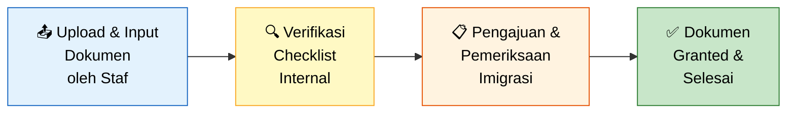

#### 2.3.4 Batasan Fitur Otomatisasi

Fitur otomatisasi pada sistem ini dibatasi pada tiga hal berikut:

|  #  | Fitur Otomatis                          | Deskripsi                                                                                                                            | Contoh                                                    |
| :-: | --------------------------------------- | ------------------------------------------------------------------------------------------------------------------------------------ | --------------------------------------------------------- |
|  1  | **Pemberian Nomor ID Pendaftaran**      | Sistem secara otomatis men-generate nomor resi unik saat pengajuan dibuat                                                            | `GV-2026-00001`                                           |
|  2  | **Pembaruan Status ke Dashboard Klien** | Ketika staf mengubah status di dashboard admin, perubahan langsung terefleksi di portal klien yang login secara otomatis (real-time) | Status berubah dari "Verifikasi" → "Diajukan ke Imigrasi" |
|  3  | **Pembuatan Laporan Periodik**          | Sistem dapat men-generate laporan statistik pengajuan secara periodik (harian/mingguan/bulanan)                                      | Rekap jumlah pengajuan per bulan                          |

#### 2.3.5 Batasan Platform

Sistem dikembangkan sebagai **aplikasi berbasis website** yang diakses melalui peramban (_browser_). Batasan platform meliputi:

| Aspek               | Spesifikasi                                       |
| ------------------- | ------------------------------------------------- |
| **Platform**        | Web Application (Browser-based)                   |
| **Responsive**      | ✅ Mendukung tampilan desktop, tablet, dan mobile |
| **Android Native**  | ❌ Tidak dicakup                                  |
| **iOS Native**      | ❌ Tidak dicakup                                  |
| **Desktop App**     | ❌ Tidak dicakup                                  |
| **Browser Support** | Chrome 90+, Firefox 88+, Safari 14+, Edge 90+     |

#### 2.3.6 Batasan Pengelolaan Dokumen (File)

Sistem memfasilitasi pengunggahan dokumen dengan batasan berikut:

| Aspek                       | Spesifikasi                                                                       |
| --------------------------- | --------------------------------------------------------------------------------- |
| **Format File Didukung**    | PDF, JPG, JPEG, PNG                                                               |
| **Ukuran Maksimum**         | 10 MB per file                                                                    |
| **Penyimpanan**             | Supabase Storage (S3-compatible)                                                  |
| **Validasi Keaslian**       | ❌ **Tidak tersedia** — Tidak melakukan validasi keaslian dokumen secara otomatis |
| **Pemeriksaan Kelengkapan** | ✅ Checklist kelengkapan per jenis visa (manual oleh staf)                        |
| **Pemeriksaan Keabsahan**   | ✅ Dilakukan **sepenuhnya secara manual** oleh staf perusahaan                    |

---

## 3. Arsitektur Sistem

### 3.1 Diagram Arsitektur High-Level

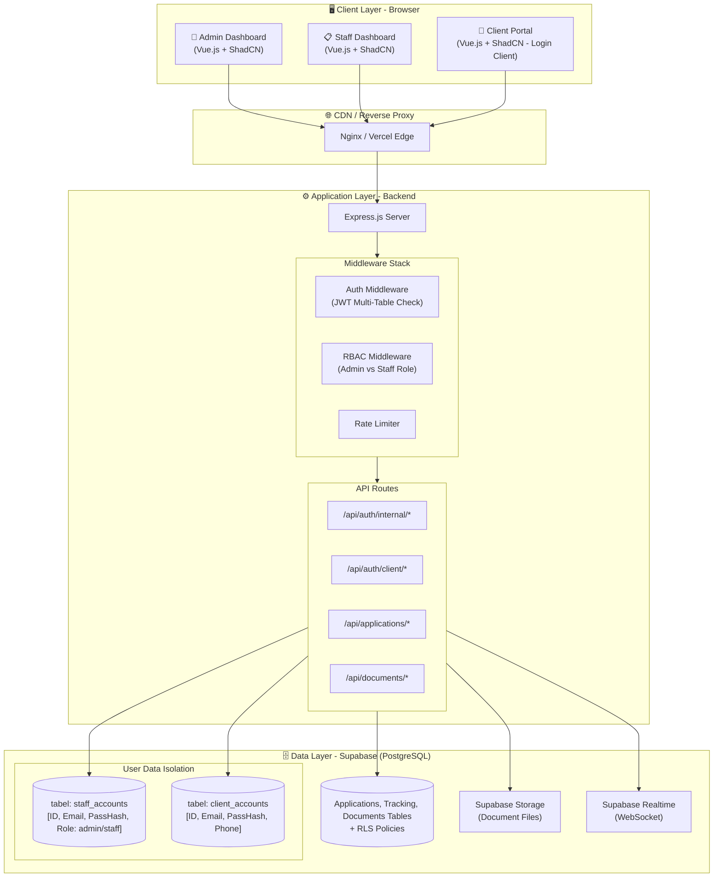

### 3.2 Arsitektur Folder Project (Pembaruan Skema)

```
gudang-visa-tracking/
├── client/                          # Frontend Vue.js
│   ├── src/
│   │   ├── pages/
│   │   │   ├── auth/
│   │   │   │   ├── LoginPage.vue       # Login khusus Admin/Staff (Rute /login)
│   │   │   │   └── ClientLoginPage.vue # Login khusus Client (Rute /portal/login)
│   │   │   ├── admin/
│   │   │   ├── staff/
│   │   │   └── client/
│   └── package.json
│
├── server/                          # Backend Express.js
│   ├── src/
│   │   ├── db/
│   │   │   ├── schema/
│   │   │   │   ├── staff_accounts.ts  # Tabel Akun Internal (Admin/Staff)
│   │   │   │   ├── client_accounts.ts # Tabel Akun Pelanggan (Client Only)
│   │   │   │   ├── applications.ts    # Relasi ke client_accounts & staff_accounts (Checklist & Biometrik terlebur)
│   │   │   │   ├── documents.ts       # Menggunakan Enum document_type
│   │   │   │   ├── tracking.ts
│   │   │   │   ├── notifications.ts
│   │   │   │   └── audit-logs.ts
│   │   ├── routes/
│   │   │   ├── auth-internal.routes.ts
│   │   │   ├── auth-client.routes.ts
│   │   │   └── application.routes.ts
│   │   ├── services/
│   │   │   ├── auth-internal.service.ts
│   │   │   ├── auth-client.service.ts
│   │   │   └── application.service.ts
│   └── package.json
```

---

## 4. Entity Relationship Diagram (ERD)

Di bawah ini adalah diagram ERD optimal yang sudah direduksi menjadi **7 tabel utama** dengan memanfaatkan **JSONB** untuk checklist dinamis dan **lebur kolom** untuk biometric schedules.

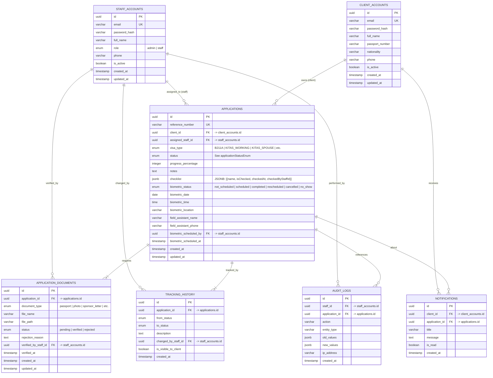

---

## 5. Logical Record Structure (LRS)

Dengan dihilangkannya tabel-tabel master (`visa_types`, `document_types`) dan penggabungan `biometric_schedules` & `application_checklist` ke dalam tabel `applications` (menggunakan kolom bawaan & JSONB), kueri menjadi sangat linear dan bebas _loop_.

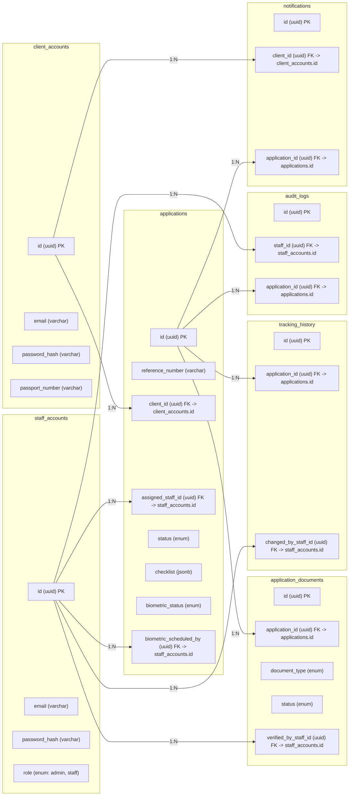

---

## 6. Database Schema Detail (Drizzle Multi-Table Teroptimasi)

Berikut adalah kode TypeScript Drizzle ORM yang mendefinisikan skema optimal basis data 7 tabel dengan performa kueri maksimal dan integritas tipe data terjamin.

```typescript
import {
  pgTable,
  uuid,
  varchar,
  boolean,
  timestamp,
  integer,
  pgEnum,
  text,
  date,
  time,
  jsonb,
} from 'drizzle-orm/pg-core';
import { relations } from 'drizzle-orm';

// === Enum Definitions ===
export const internalRoleEnum = pgEnum('internal_role', ['admin', 'staff']);
export const applicationStatusEnum = pgEnum('application_status', [
  'draft',
  'document_collection',
  'document_verification',
  'document_revision',
  'submission_to_immigration',
  'immigration_review',
  'biometric_scheduled',
  'biometric_completed',
  'immigration_processing',
  'approval_pending',
  'approved',
  'evisa_issued',
  'completed',
  'rejected',
  'cancelled',
  'on_hold',
]);
export const visaTypeEnum = pgEnum('visa_type', [
  'B211A',
  'KITAS_WORKING',
  'KITAS_SPOUSE',
  'KITAS_INVESTOR',
  'KITAS_RETIREMENT',
]);
export const documentTypeEnum = pgEnum('document_type', [
  'passport',
  'photo',
  'sponsor_letter',
  'company_nib',
  'bank_statement',
  'rejection_letter',
  'final_evisa',
]);
export const documentStatusEnum = pgEnum('document_status', [
  'pending',
  'verified',
  'rejected',
]);
export const biometricStatusEnum = pgEnum('biometric_status', [
  'not_scheduled',
  'scheduled',
  'completed',
  'rescheduled',
  'cancelled',
  'no_show',
]);

// === 1. Tabel Akun Internal (Admin / Staff) ===
export const staffAccounts = pgTable('staff_accounts', {
  id: uuid('id').primaryKey().defaultRandom(),
  email: varchar('email', { length: 255 }).unique().notNull(),
  passwordHash: varchar('password_hash', { length: 255 }).notNull(),
  fullName: varchar('full_name', { length: 255 }).notNull(),
  role: internalRoleEnum('role').default('staff').notNull(),
  phone: varchar('phone', { length: 50 }),
  isActive: boolean('is_active').default(true).notNull(),
  createdAt: timestamp('created_at').defaultNow().notNull(),
  updatedAt: timestamp('updated_at').defaultNow().notNull(),
});

// === 2. Tabel Akun Eksternal (Client / Pelanggan) ===
export const clientAccounts = pgTable('client_accounts', {
  id: uuid('id').primaryKey().defaultRandom(),
  email: varchar('email', { length: 255 }).unique().notNull(),
  passwordHash: varchar('password_hash', { length: 255 }).notNull(),
  fullName: varchar('full_name', { length: 255 }).notNull(),
  passportNumber: varchar('passport_number', { length: 50 }).notNull(),
  nationality: varchar('nationality', { length: 100 }).notNull(),
  phone: varchar('phone', { length: 50 }),
  isActive: boolean('is_active').default(true).notNull(),
  createdAt: timestamp('created_at').defaultNow().notNull(),
  updatedAt: timestamp('updated_at').defaultNow().notNull(),
});

// === 3. Tabel Aplikasi Pemantauan Visa (Dengan Lebur Kolom & JSONB) ===
export const applications = pgTable('applications', {
  id: uuid('id').primaryKey().defaultRandom(),
  referenceNumber: varchar('reference_number', { length: 20 })
    .unique()
    .notNull(),
  clientId: uuid('client_id')
    .references(() => clientAccounts.id, { onDelete: 'cascade' })
    .notNull(),
  assignedStaffId: uuid('assigned_staff_id').references(
    () => staffAccounts.id,
    { onDelete: 'set null' },
  ),
  visaType: visaTypeEnum('visa_type').notNull(),
  status: applicationStatusEnum('status').default('draft').notNull(),
  progressPercentage: integer('progress_percentage').default(0).notNull(),
  notes: text('notes'),

  // Checklist Dinamis disimpan sebagai JSONB Array untuk eliminasi tabel checklist terpisah
  // Format Skema Objek: [{ name: string, isChecked: boolean, checkedAt?: string, checkedByStaffId?: string }]
  checklist: jsonb('checklist').default([]).notNull(),

  // Penggabungan Kolom Biometrik Jarak Jauh (1-to-1 table reduction)
  biometricStatus: biometricStatusEnum('biometric_status')
    .default('not_scheduled')
    .notNull(),
  biometricDate: date('biometric_date'),
  biometricTime: time('biometric_time'),
  biometricLocation: varchar('biometric_location', { length: 500 }),
  fieldAssistantName: varchar('field_assistant_name', { length: 255 }),
  fieldAssistantPhone: varchar('field_assistant_phone', { length: 50 }),
  biometricScheduledBy: uuid('biometric_scheduled_by').references(
    () => staffAccounts.id,
    { onDelete: 'set null' },
  ),
  biometricScheduledAt: timestamp('biometric_scheduled_at'),

  createdAt: timestamp('created_at').defaultNow().notNull(),
  updatedAt: timestamp('updated_at').defaultNow().notNull(),
});

// === 4. Tabel Dokumen Persyaratan ===
export const applicationDocuments = pgTable('application_documents', {
  id: uuid('id').primaryKey().defaultRandom(),
  applicationId: uuid('application_id')
    .references(() => applications.id, { onDelete: 'cascade' })
    .notNull(),
  documentType: documentTypeEnum('document_type').notNull(),
  fileName: varchar('file_name', { length: 255 }).notNull(),
  filePath: varchar('file_path', { length: 500 }).notNull(),
  status: documentStatusEnum('status').default('pending').notNull(),
  rejectionReason: text('rejection_reason'),
  verifiedByStaffId: uuid('verified_by_staff_id').references(
    () => staffAccounts.id,
    { onDelete: 'set null' },
  ),
  verifiedAt: timestamp('verified_at'),
  createdAt: timestamp('created_at').defaultNow().notNull(),
  updatedAt: timestamp('updated_at').defaultNow().notNull(),
});

// === 5. Tabel Riwayat Pelacakan Status ===
export const trackingHistory = pgTable('tracking_history', {
  id: uuid('id').primaryKey().defaultRandom(),
  applicationId: uuid('application_id')
    .references(() => applications.id, { onDelete: 'cascade' })
    .notNull(),
  fromStatus: applicationStatusEnum('from_status'),
  toStatus: applicationStatusEnum('to_status').notNull(),
  description: text('description').notNull(),
  changedByStaffId: uuid('changed_by_staff_id').references(
    () => staffAccounts.id,
    { onDelete: 'set null' },
  ),
  isVisibleToClient: boolean('is_visible_to_client').default(true).notNull(),
  createdAt: timestamp('created_at').defaultNow().notNull(),
});

// === 6. Tabel Notifikasi Klien ===
export const notifications = pgTable('notifications', {
  id: uuid('id').primaryKey().defaultRandom(),
  clientId: uuid('client_id')
    .references(() => clientAccounts.id, { onDelete: 'cascade' })
    .notNull(),
  applicationId: uuid('application_id')
    .references(() => applications.id, { onDelete: 'cascade' })
    .notNull(),
  title: varchar('title', { length: 255 }).notNull(),
  message: text('message').notNull(),
  isRead: boolean('is_read').default(false).notNull(),
  createdAt: timestamp('created_at').defaultNow().notNull(),
});

// === 7. Tabel Log Audit Aktivitas Internal ===
export const auditLogs = pgTable('audit_logs', {
  id: uuid('id').primaryKey().defaultRandom(),
  staffId: uuid('staff_id').references(() => staffAccounts.id, {
    onDelete: 'set null',
  }),
  applicationId: uuid('application_id').references(() => applications.id, {
    onDelete: 'set null',
  }),
  action: varchar('action', { length: 100 }).notNull(), // e.g., 'CREATE_APP', 'UPDATE_STATUS', 'CHECKLIST_TOGGLE'
  entityType: varchar('entity_type', { length: 100 }).notNull(), // 'applications' | 'documents' etc.
  oldValues: jsonb('old_values'),
  newValues: jsonb('new_values'),
  ipAddress: varchar('ip_address', { length: 45 }),
  createdAt: timestamp('created_at').defaultNow().notNull(),
});

// === Drizzle Relations ===
export const staffAccountsRelations = relations(staffAccounts, ({ many }) => ({
  assignedApplications: many(applications),
  verifiedDocuments: many(applicationDocuments),
  trackingHistoryUpdates: many(trackingHistory),
  auditLogs: many(auditLogs),
}));

export const clientAccountsRelations = relations(
  clientAccounts,
  ({ many }) => ({
    applications: many(applications),
    notifications: many(notifications),
  }),
);

export const applicationsRelations = relations(
  applications,
  ({ one, many }) => ({
    client: one(clientAccounts, {
      fields: [applications.clientId],
      references: [clientAccounts.id],
    }),
    assignedStaff: one(staffAccounts, {
      fields: [applications.assignedStaffId],
      references: [staffAccounts.id],
    }),
    documents: many(applicationDocuments),
    trackingHistory: many(trackingHistory),
  }),
);
```

---

## 7. Class Diagram (Pembaruan Kontrol)

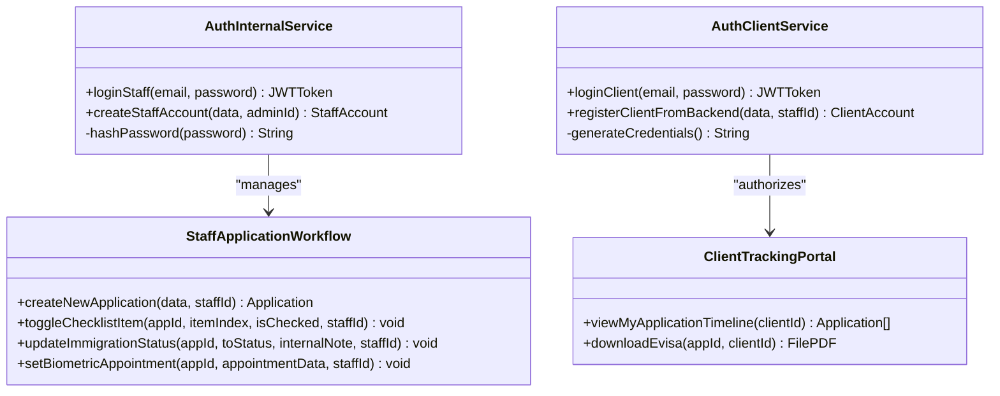

---

## 8. Activity Diagram

### 8.1 Alur Kerja Manajemen Internal & Operasional (Sisi Admin / Staff)

Diagram aktivitas ini berfokus pada workflow staf di backoffice saat memproses aplikasi visa, melakukan verifikasi teknis menggunakan checklist JSONB, hingga koordinasi biometrik lapangan.

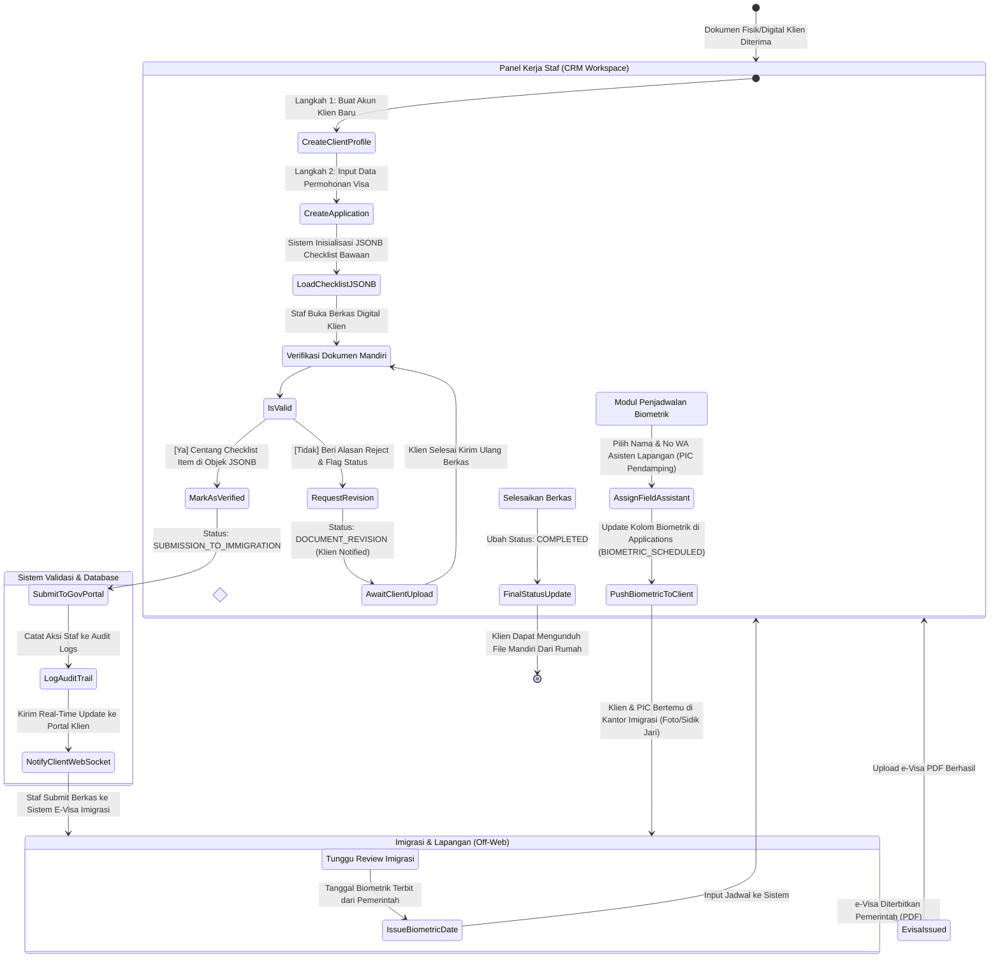

---

## 9. Sequence Diagram

### 9.1 Alur Autentikasi Terpisah & Operasional Real-Time

Menunjukkan pemisahan mutlak endpoint autentikasi, pengecekan password hash di masing-masing tabel, serta workflow pengisian asisten lapangan biometrik terlebur langsung pada aplikasi.

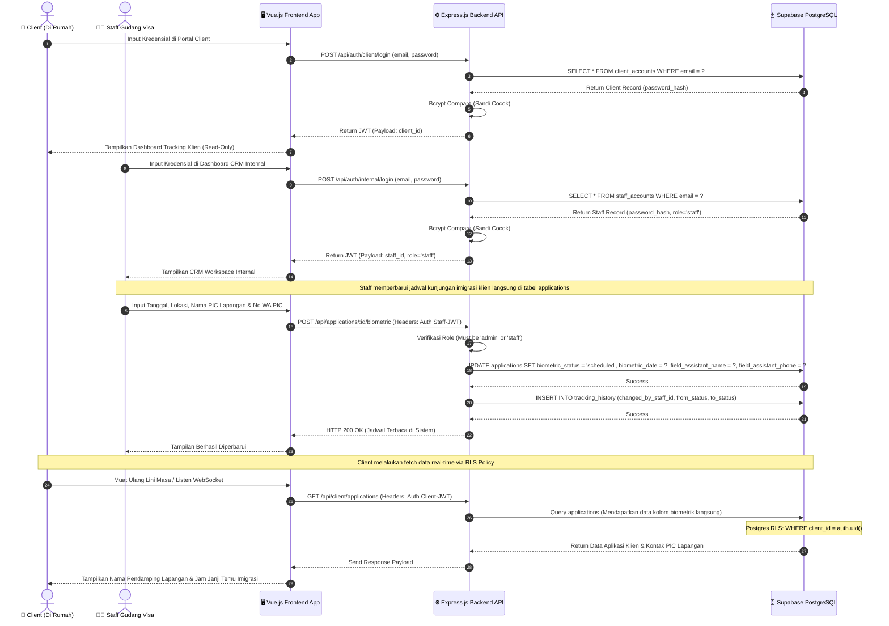

---

## 10. Spesifikasi Fitur (Sisi Admin / Staff Workflow Detail)

### F-01: Dashboard Admin (Internal Team Management)

- **Manajemen Akun Staf & Klien Terpisah**: Modul eksklusif Admin untuk melakukan operasi CRUD pada tabel `staff_accounts` dan `client_accounts`. UI menggunakan tab terpisah untuk menghindari kesalahan eskalasi kredensial (misalnya memberikan klien peran staf). Admin menginputkan data dengan form context-aware sesuai jenis akun (Karyawan vs Klien).
- **Global Audit Logs Viewer**: Halaman log sistem untuk melacak aktivitas operasional staf secara mendalam (misal: "Staff A mengubah status aplikasi GV-2026-001 menjadi APPROVED pada jam 10:00").
- **Akses Cepat Tracking Dokumen**: Tombol "Check Tracking Document" disediakan secara prominen di Dashboard, yang langsung mengarahkan Admin/Staf ke riwayat status semua aplikasi klien.

### F-02: Dashboard Staff (CRM Workflow Panel)

- **Pendaftaran Profil Klien Instan**: Sebelum membuat aplikasi tracking, staf mendaftarkan akun klien terlebih dahulu ke dalam tabel `client_accounts` berdasarkan data paspor/KTP fisik yang dikirim klien via email/offline. Kredensial acak di-generate otomatis oleh backend dan dikirimkan ke email klien.
- **Checklist Verifikator Berkas (JSONB Engine)**: Panel khusus staf untuk memeriksa berkas satu-per-satu. Checklist diimplementasikan secara dinamis menggunakan tipe data JSONB di dalam tabel `applications`. Staf mencentang kelengkapan berkas imigrasi, dan sistem secara otomatis memperbarui status aplikasi (`status`) jika semua item checklist telah terpenuhi tanpa kueri join yang berat.

### F-09: Biometric Scheduling Coordination (Integrated Workflow)

- **Assign PIC Lapangan**: Fitur pengisian slot asisten operasional lapangan. Data janji temu (Hari, Jam, Lokasi Kantor Imigrasi) dan asisten pendamping Gudang Visa disimpan langsung sebagai kolom dalam tabel `applications` untuk eliminasi relasi tabel 1-to-1 yang memicu overhead latensi.

### F-03: Client Tracking Portal (Self-Service)

- **Login Klien Terpisah**: Endpoint dan halaman login khusus klien (`/portal/login`) yang terisolasi dari login internal staf/admin. Sesi klien menggunakan _access token_ + _refresh token_ tersendiri (kunci penyimpanan `client_auth_token`) sehingga kebocoran salah satu sesi tidak meng-eskalasi sesi lainnya.
- **Dashboard Pelacakan Pribadi** (`/portal`): Menampilkan seluruh permohonan milik klien yang sedang login, lengkap dengan _status stepper_, persentase progres, dan _timeline_ riwayat yang ditandai `is_visible_to_client`.
- **Unduh Dokumen Selesai**: Untuk dokumen yang telah diverifikasi/selesai (mis. e-Visa PDF), klien menekan tombol unduh; backend memverifikasi kepemilikan dokumen (dokumen → aplikasi → `client_id`) lalu mengeluarkan _signed URL_ sementara dari Supabase Storage. Klien tidak pernah dapat mengakses dokumen milik klien lain.
- **Live Updates**: Status diperbarui otomatis melalui _polling_ berkala tanpa perlu _refresh_ manual (lihat §13.1).

### Demo Data Seeding

- Skrip `npm run seed` (backend) bersifat **idempotent**: membuat akun admin awal bila belum ada, lalu menyisipkan **100 akun klien demo** (`client1@gudangvisa.com` … `client100@gudangvisa.com`, kata sandi seragam `client123`). Akun yang sudah ada (dicocokkan via email) dilewati sehingga skrip aman dijalankan berulang.

---

## 11. Keamanan & Otorisasi

### 11.1 Isolasi Basis Data Pengguna (Multi-Table Security)

Untuk meminimalisir risiko kebocoran hak akses escalations (_Privilege Escalation Attacks_), arsitektur tidak menggunakan trik kolom fungsional tunggal role dalam satu tabel. Data akun klien eksternal disimpan di tabel `client_accounts`, sedangkan data administrator dan staf disimpan di tabel `staff_accounts`. Kebocoran pada token salah satu tabel tidak dapat digunakan untuk membobol sistem di tabel lainnya.

### 11.2 Pembaruan Row Level Security (RLS) PostgreSQL

Row Level Security diaktifkan pada Supabase PostgreSQL untuk menjamin isolasi data mutlak klien:

```sql
-- Mengamankan tabel applications agar klien hanya melihat miliknya sendiri
ALTER TABLE applications ENABLE ROW LEVEL SECURITY;

CREATE POLICY "Clients can only read their own applications"
ON applications
FOR SELECT
USING (clientId = auth.uid()); -- auth.uid() terhubung ke client_accounts.id

CREATE POLICY "Staff can do all actions on applications"
ON applications
FOR ALL
USING (
  EXISTS (
    SELECT 1 FROM staff_accounts
    WHERE staff_accounts.id = auth.uid() -- auth.uid() terhubung ke staff_accounts.id
  )
);
```

### 11.3 Strategi Optimasi Keamanan Token (XSS-Safe Token Architecture)

Guna melindungi data keimigrasian sensitif klien dari serangan pencurian token melalui eksploitasi celah Cross-Site Scripting (XSS), sistem ini menetapkan strategi pembagian penyimpanan token JWT (_Segregated Token Architecture_) secara ketat:

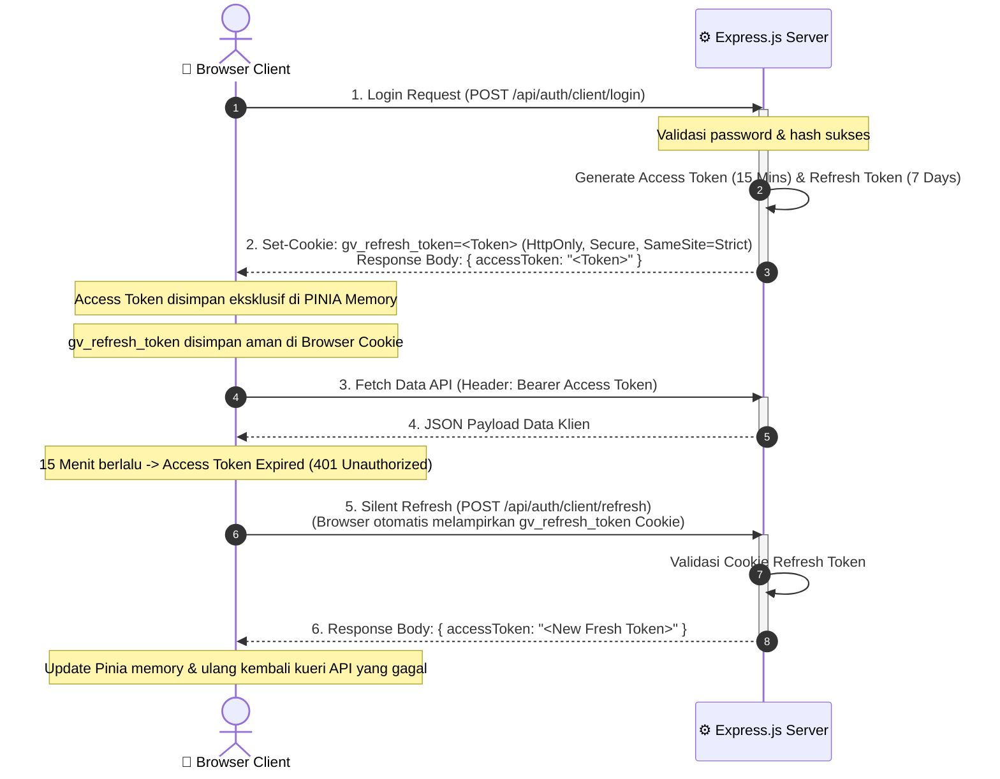

#### A. Kebijakan Penyimpanan Token

1. **Access Token (Short-Lived, In-Memory)**:
   - **Masa Aktif**: 15 Menit.
   - **Lokasi Penyimpanan**: Disimpan secara reaktif eksklusif di dalam **State Memory Pinia** (_in-memory storage_).
   - **Keamanan**: Tidak ditulis ke `LocalStorage` atau `SessionStorage`. Jika halaman dimuat ulang (_F5/Refresh_), memori reaktif akan terhapus bersih. Hal ini disengaja agar tidak ada jejak token persisten yang dapat dipindai oleh skrip JS berbahaya (XSS).
2. **Refresh Token (Long-Lived, HttpOnly Cookie)**:
   - **Masa Aktif**: 7 Hari.
   - **Lokasi Penyimpanan**: Disimpan di dalam **HttpOnly, Secure, & SameSite=Strict Cookie** bernama `gv_refresh_token` di peramban.
   - **Keamanan**: JavaScript diblokir total oleh peramban untuk membaca atau memodifikasi cookie ini (`httpOnly: true`). Cookie otomatis dilampirkan oleh peramban hanya pada kueri ke rute tertentu (`path: '/api/auth/refresh'`).

#### B. Implementasi Langkah 1: Backend Update (Express.js Cookies)

Saat login berhasil, backend memisahkan penyaluran token. Access token dikembalikan sebagai JSON body, sedangkan refresh token disuntikkan langsung sebagai HttpOnly cookie:

```typescript
// server/src/services/auth.service.ts
import { Response } from 'express';

export const sendTokens = (
  res: Response,
  accessToken: string,
  refreshToken: string,
) => {
  // Set Refresh Token dalam HttpOnly Cookie secara aman
  res.cookie('gv_refresh_token', refreshToken, {
    httpOnly: true, // Proteksi mutlak XSS: JavaScript tidak bisa membaca cookie ini
    secure: process.env.NODE_ENV === 'production', // Hanya terkirim lewat HTTPS di produksi
    sameSite: 'strict', // Proteksi mutlak CSRF
    maxAge: 7 * 24 * 60 * 60 * 1000, // Kadaluarsa dalam 7 Hari
    path: '/api/auth/refresh', // Hanya dikirim saat memicu silent refresh
  });

  // Access Token dikembalikan via JSON Body untuk disimpan di memory Pinia
  return res.json({ accessToken });
};
```

#### C. Implementasi Langkah 2: Konfigurasi CORS pada Backend

Karena browser menolak pertukaran cookie lintas-asal secara _default_, backend wajib mengonfigurasi CORS secara eksplisit untuk memperbolehkan credentials (`credentials: true`) dan membatasi domain asal ke URL client (bukan wildcard `*`):

```typescript
// server/src/app.ts
import express from 'express';
import cors from 'cors';

const app = express();

app.use(
  cors({
    origin: process.env.FRONTEND_URL || 'http://localhost:5173', // Domain frontend Vue
    credentials: true, // Wajib bernilai true untuk menerima & mengirimkan cookies
    methods: ['GET', 'POST', 'PUT', 'DELETE', 'OPTIONS'],
    allowedHeaders: ['Content-Type', 'Authorization'],
  }),
);
```

#### D. Implementasi Langkah 3: Konfigurasi Axios Frontend (`withCredentials`)

Pada aplikasi frontend Vue, pustaka Axios dikonfigurasi secara global agar peramban selalu menyertakan HttpOnly cookie pada setiap _request_ asinkron lintas-asal secara otomatis:

```typescript
// client/src/lib/axios.ts
import axios from 'axios';

const api = axios.create({
  baseURL: import.meta.env.VITE_API_URL || 'http://localhost:3000',
  withCredentials: true, // Wajib diaktifkan untuk melampirkan cookie refresh token
});

export default api;
```

#### E. Implementasi Langkah 4: Manajemen Pinia & Silent Refresh Interceptor

Access Token dikelola di dalam reactive state Pinia Store, dan Axios Interceptor dipasang untuk memantau status `401 Unauthorized` (karena Access Token kedaluwarsa). Jika terjadi eror 401, Interceptor akan secara senyap melakukan regenerasi token (_silent refresh_) dan mengulang kembali kueri yang sempat gagal tanpa disadari oleh pengguna:

```typescript
// client/src/stores/auth.ts
import { defineStore } from 'pinia';
import api from '../lib/axios';

export const useAuthStore = defineStore('auth', {
  state: () => ({
    accessToken: null as string | null,
    user: null as any | null,
  }),
  actions: {
    setAccessToken(token: string | null) {
      this.accessToken = token;
    },
    async silentRefresh() {
      try {
        // Melakukan request silent refresh ke backend (Express otomatis membaca gv_refresh_token Cookie)
        const response = await api.post('/api/auth/refresh');
        this.accessToken = response.data.accessToken;
        return response.data.accessToken;
      } catch (error) {
        this.logout();
        throw error;
      }
    },
    logout() {
      this.accessToken = null;
      this.user = null;
      api.post('/api/auth/logout'); // Clear HttpOnly Cookie di backend
    },
  },
});
```

Mekanisme Axios Interceptor untuk _Silent Retry_:

```typescript
// client/src/lib/axios.ts (Lanjutan)
import api from './axios';
import { useAuthStore } from '../stores/auth';

// Interceptor Request: Menyisipkan Access Token di header jika tersedia di Pinia memory
api.interceptors.request.use(
  (config) => {
    const authStore = useAuthStore();
    if (authStore.accessToken && config.headers) {
      config.headers.Authorization = `Bearer ${authStore.accessToken}`;
    }
    return config;
  },
  (error) => Promise.reject(error),
);

// Interceptor Response: Menangani Eror 401 & Memicu Silent Refresh
api.interceptors.response.use(
  (response) => response,
  async (error) => {
    const originalRequest = error.config;
    const authStore = useAuthStore();

    // Jika terjadi 401 karena token expired, dan request belum pernah di-retry
    if (error.response?.status === 401 && !originalRequest._retry) {
      originalRequest._retry = true; // Tandai agar tidak memicu infinite loop

      try {
        // Picu silent refresh untuk mendapatkan access token baru
        const newAccessToken = await authStore.silentRefresh();

        // Perbarui header request original dengan token baru
        originalRequest.headers.Authorization = `Bearer ${newAccessToken}`;

        // Jalankan ulang request yang sempat gagal tadi
        return api(originalRequest);
      } catch (refreshError) {
        return Promise.reject(refreshError);
      }
    }
    return Promise.reject(error);
  },
);
```

---

## 12. Non-Functional Requirements

| Parameter                 | Metrik Kinerja yang Disyaratkan                                                                                                                                                                      |
| ------------------------- | ---------------------------------------------------------------------------------------------------------------------------------------------------------------------------------------------------- |
| **Performa & Latensi**    | - Page load awal portal klien kurang dari `1.5 detik` pada jaringan 3G/4G (dioptimalkan lewat reduksi JOIN).<br/>- Query database & filter dashboard staf kurang dari `200 ms` berkat skema 7 tabel. |
| **Ketersediaan (Uptime)** | Tingkat ketersediaan sistem minimum `99.9%` (Uptime) di-host di server Supabase / Vercel Edge.                                                                                                       |
| **Kapasitas Penyimpanan** | Mampu menampung hingga `10.000` berkas PDF/Image dokumen aktif dengan Supabase Storage terkompresi.                                                                                                  |
| **Responsivitas UI**      | Desain web responsif penuh (Mobile-Friendly) menggunakan TailwindCSS & ShadCN-Vue, dioptimalkan untuk performa Google Lighthouse ≥ 92.                                                               |

---

## 13. Tech Stack & Dependency

### 13.1 Frontend (Vue 3 Client)

- **Core Framework**: Vue 3 (Composition API) & TypeScript
- **State Management**: Pinia (Auth & System state caching)
- **Router**: Vue Router (dengan Navigation Guard terpisah untuk rute internal & rute klien)
- **Styling & Components**: TailwindCSS, Radix Vue, & ShadCN-Vue (Premium UI)
- **HTTP Client**: Axios (instance terpisah untuk sesi internal & sesi klien, masing-masing dengan Interceptor _silent refresh_ ke endpoint refresh-nya sendiri)
- **Realtime / Live Updates**: Pembaruan _live_ pada Portal Klien & halaman tracking publik diimplementasikan saat ini melalui **interval polling** (~10 detik) terhadap REST API — otomatis berhenti saat tab tersembunyi (`visibilitychange`) dan dibersihkan saat _unmount_ untuk mencegah _memory leak_. Migrasi ke **Supabase Realtime (WebSocket)** disiapkan sebagai _roadmap_ tanpa mengubah lapisan UI.

### 13.2 Backend (Express.js API)

- **Core Runtime**: Node.js LTS (v20+) & Express.js dengan TypeScript
- **ORM**: Drizzle ORM (Type-Safe queries) & Drizzle Kit (Database migrations)
- **Validasi Skema**: Zod (Validator payload JSON request & input form)
- **Enkripsi & Token**: `bcryptjs` (Hashing password) & `jsonwebtoken` (JWT creation)
- **Keamanan Web**: Helmet.js (Menuliskan headers keamanan HTTP), CORS (kebijakan asal rute domain), & `express-rate-limit` (pencegahan serangan brute-force API).

---

## 14. Rencana Implementasi

Sistem dikembangkan menggunakan metode **Waterfall SDLC** selama **12 Minggu** secara terstruktur:

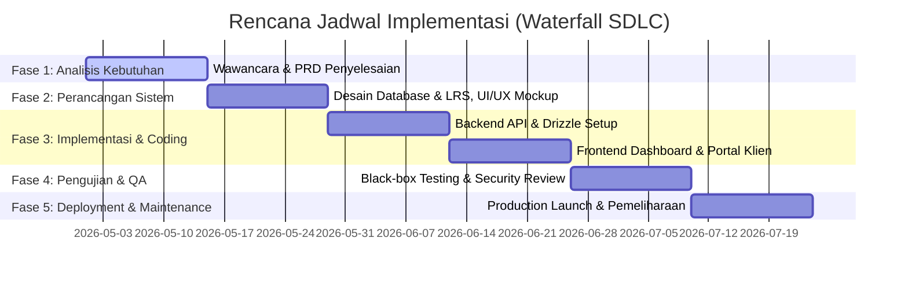

---

## 15. Lampiran

### 15.1 Standar Foto Keimigrasian Gudang Visa

- Ukuran berkas maksimum: **200 kb**.
- Komposisi wajah: **50% - 60%** dari luas bingkai foto.
- Latar belakang foto: Berwarna kontras polos sesuai tipe visa.
- Masa berlaku paspor minimal: **6 Bulan** dari tanggal rencana kedatangan di Indonesia.

### 15.2 Changelog

| Versi | Tanggal     | Ringkasan Perubahan                                                                                                                                                                                                                                                                                                                          |
| ----- | ----------- | --------------------------------------------------------------------------------------------------------------------------------------------------------------------------------------------------------------------------------------------------------------------------------------------------------------------------------------------- |
| 1.7.0 | 1 Jun 2026  | • Audit trail diaktifkan penuh di seluruh modul (kolom Timestamp, User, Action, Entity, IP Address; filter _action_ & _entity_).<br/>• Portal Klien _self-service_: login klien terpisah (`/portal/login` → `/portal`), unduh dokumen selesai via _signed URL_ dengan verifikasi kepemilikan.<br/>• Halaman manajemen klien dihapus dari dashboard internal; 100 akun klien demo di-_seed_ secara idempotent (`client123`).<br/>• Pembaruan status _live_ via interval polling (tanpa refresh manual) dengan pembersihan listener/timer untuk mencegah _memory leak_. |
| 1.6.1 | 1 Jun 2026  | Skema 7-tabel teroptimasi (biometrik & checklist terlebur), autentikasi dual-table, RLS, dan arsitektur token XSS-safe.                                                                                                                                                                                                                       |
